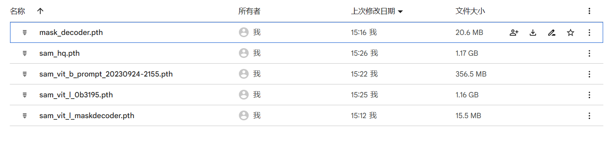
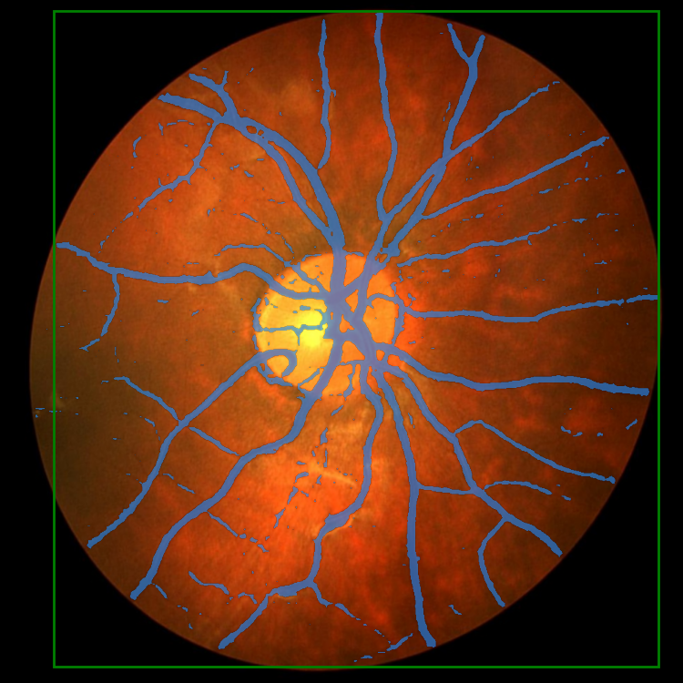
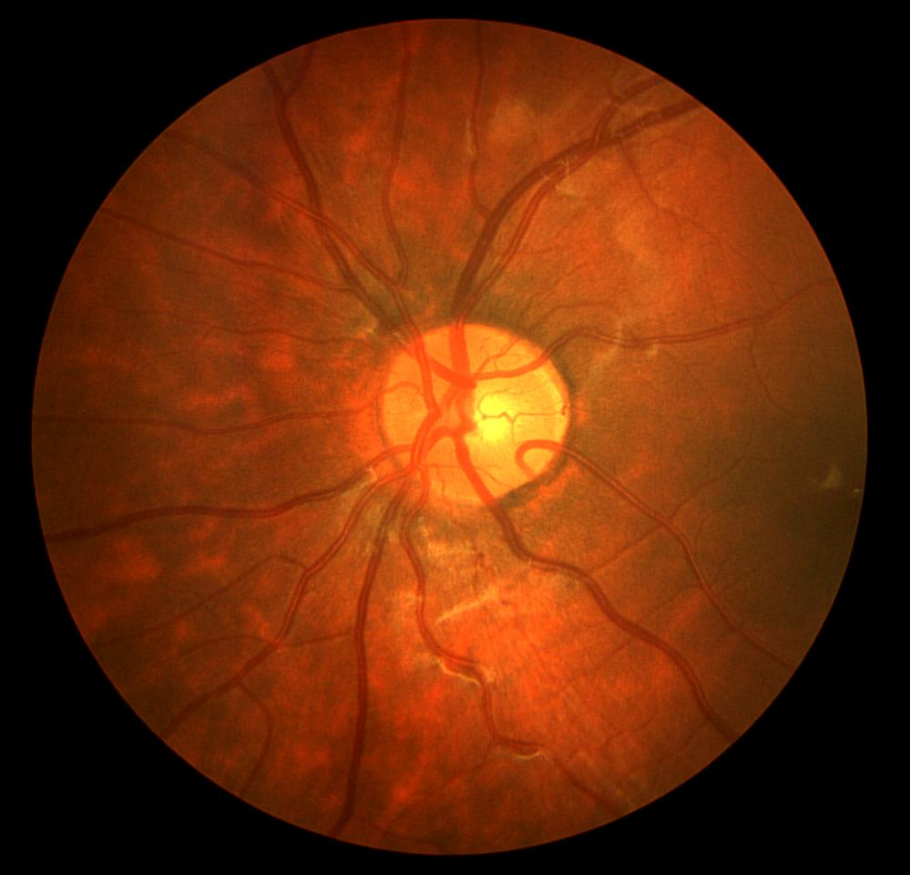
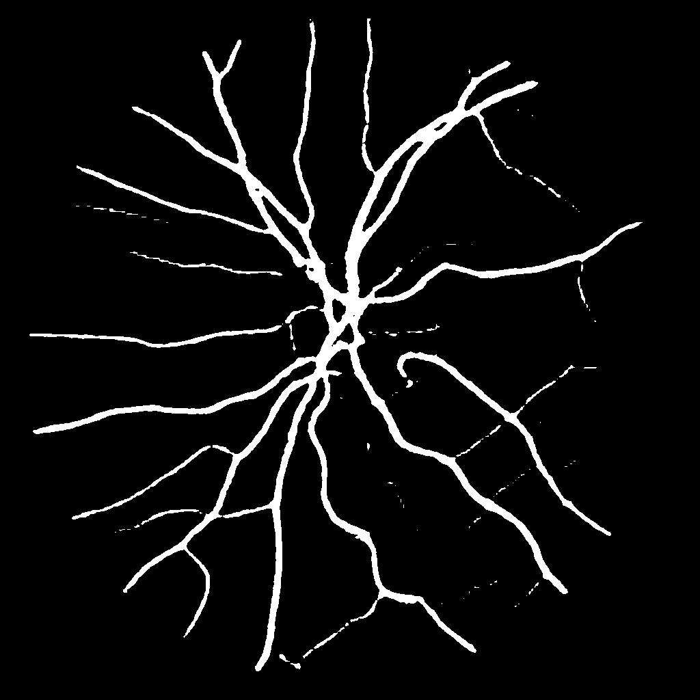

##https://github.com/heymayn/AI-FOR-SCI_Retinal-Vessel-Segmentation-by-SAM/tree/main

# Retinal-Vessel-Segmentation-by-SAM
Here's the code for the work we did in the AI-FOR-SCIENCE competition.

In order to explore the performance of the segmentation-based large model SAM on the downstream task-fundus vessel segmentation, we successively tried three models。
Here we provide the relevant code for three different models:
```
|sam_hq
|BVSAM(original sam on Blood Vessel segmentation)
|learnable_prompt_sam
```

For more details, check out our technical report.
	
#preparation

All the checkpoint files can be downloaded  [here](https://drive.google.com/drive/folders/1-kzNpA_vdlIzaGZEURr5DJvVMDCugaQc?usp=drive_link)




CHASEDB1 dataset can be downloaded  [here](https://drive.google.com/drive/folders/1bubcizfo9shiJByt97-yVsO60MDm37yG?usp=drive_link).

## environment
run ```pip install -e .``` 


# 1.sam-hq
We organize the training folder as follows.

```
|train_sam_hq
|    |____CHASEDB1
|    |____pretrained_checkpoint
|    |____train.py
|    |____predict.py
|    |____utils
|    |   |___dataloader.py
|    |   |____misc.py
|    |   |____loss_mask.py
|    |____segment_anything_training
|    |____output
```

## a. Data Preparation

we have done Augment on the original CHASEDB1 dataset

### Expected dataset structure for CHASEDB1

```
CHASEDB1
|____train
| |____img
| |____valid_mask
|____test
| |____...
| |____...
|____validation
| |____...
| |____...

```

## b. Init Checkpoint
### Expected checkpoint

```
pretrained_checkpoint
|____sam_vit_l_maskdecoder.pth
|____sam_vit_l_0b3195.pth
|____sam_decoder.pth 
```

where 
```sam_vit_l_maskdecoder.pth```  is extracted from  ``` sam_vit_l_0b3195.pth```  ```sam_vit_l.pth```

```sam_decoder.pth```  is the final model we trained.


## c. Training
run ```python train.py``` to train 

the result will be output to ```./output/date/```

## d. Evaluation
To evaluate ,run ```python predict.py```

the image will also output to ```./output/date/```


## demo result



# 2.LearnablePromptSAM
Try to use the SAM-ViT as the backbone to create the visual prompt tuning model for semantic segmentation. 
download all checkpoint [here](https://drive.google.com/drive/folders/1-kzNpA_vdlIzaGZEURr5DJvVMDCugaQc?usp=drive_link)

## a. download checkpoint and dataset
put chasedb1 dataset to:
```
dataset
| __train
| |__img
| |__mask
| __test
| |__img
| |__mask
| __valid
| |__img
| |__mask
```

put checkpoint to ```./weights/sam_vit_b_01ec64.pth```
	
## b.train

  ```
  python imporved_sam.py 
  ```

## c.predict

download pretrained checkpoint and put to
```"./weights/sam_vit_b_prompt_2023_0924_2155.pth```
To facilitate the prediction, we designed a gui.
You can run ```gui.py``` in pycharm


## d.demo result




